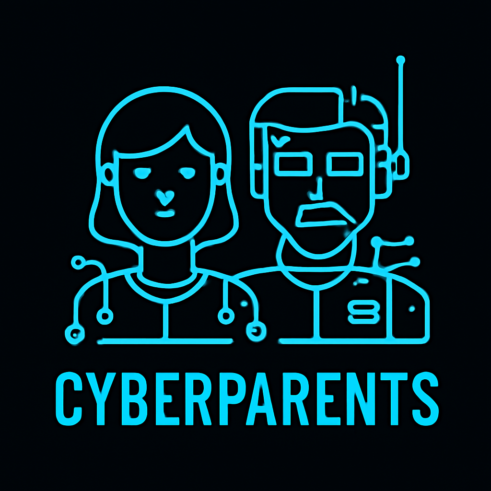

# Cyber parents你的电子爹妈

Cyber parent 通过计算机视觉，脑机接口，大语言模型等技术，弥补了你在使用电脑的过程中无法24小时受到父母监管的缺憾，帮助你提升工作效率，让你的计划更加井井有条。

他/她可以：

1. 你可以和你的爹妈进行进行语音通话（老爹现在还没有电话）
2. 帮你制定计划，你可以与你的电子爹妈讨论你接下来需要做的事情，帮助你指定具体计划，可以帮你将大目标分解为小目标，让你可以将更多精力投入在执行，而不是在计划上浪费大量时间
3. 他们也会对你进行监督，你需要在你规定的时间内完成你的计划，在这个过程中，他们会通过脑机接口监督你的专注度，也可以通过视觉的方式了解你的情绪，并通过你任务最终的剩余时间对你的进度进行跟进





# 环境配置


安装Python依赖

````bash
pip install sherpa-onnx -f https://k2-fsa.github.io/sherpa/onnx/cpu.html
pip install -r ./requirements.txt
````

复制一份配置文件

````bash
cp .env.example .env
````

打开.env文件编辑你的配置文件例如LLM API ,Emotiv License

#### KIMI API配置

1. 

#### Emotiv 配置

配置你的Emotiv账户信息和license

1. 在[Emotiv官网](https://account.emotiv.com/my-account/)中创建你的应用，并获取Client ID和Client secret，
2. 在[License申请页面](https://www.emotiv.com/pages/developer)中获取你的License
3. 从Emotiv launcher中登录你的账户并连接你的脑电设备
4. 在.env中填入你的Client ID, Client Secret, License 

#### 下载本地模型

1. 在[谷歌网盘](https://drive.google.com/file/d/1cFvBKD3ElgMIaE_wepwSHqKm-tpfNnF4/view?usp=drive_link)下载模型，并放在项目根目录的models文件夹中

启动服务

````
cd ./TodoList/frontend
npm install && npm run dev
cd ../backend
python main.py
````

在浏览器打开 `http://localhost:3000`